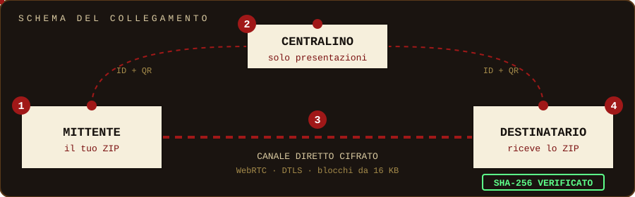

  <!-- BANNER SVG ANIMATO -->
  

    

  

    

  <!-- BADGES -->
  

    
    
    
    
    
  

 

  <h2 style="color: #d9b45a; text-transform: uppercase; margin-top: 0;">🌐 ABOUT THIS REPOSITORY / INFORMAZIONI SUL PROGETTO</h2>
  
<b>[EN]:</b> Welcome to <b>FILE & ORDER</b>, a zero-server, encrypted Peer-to-Peer file-sharing web application built with a unique <i>Detective Noir / Crime Scene</i> aesthetic. It enables direct browser-to-browser file transfers via WebRTC, complete with automatic client-side ZIP compression, SHA-256 hash verification, and an in-browser local heuristic antivirus scanner.

  
<b>[IT]:</b> Benvenuto su <b>FILE & ORDER</b>, una web app Peer-to-Peer per il trasferimento file cifrato senza l'uso di server intermedi, progettata con un'estetica <i>Detective Noir / Scena del Crimine</i>. Permette lo scambio diretto da browser a browser tramite WebRTC, integrando compressione ZIP lato client, verifica dell'impronta digitale SHA-256 e un antivirus euristico locale integrato nel browser.

 

<!-- ARCHITECTURE / FLOW DIAGRAM -->

  

 

  <h3 style="text-transform: uppercase; margin-top: 0; color: #a01818;">⚡ CORE HIGHLIGHTS / PUNTI CHIAVE</h3>
  <ul>
    <li><b>Peer-to-Peer Architecture / Architettura P2P:</b> Direct encrypted connection (WebRTC / PeerJS) between devices. Files never pass through or get stored on any remote server.</li>
    <li><b>Local Security & Integrity / Sicurezza e Integrità:</b> Automated SHA-256 cryptographic hashing to detect file tampering, combined with a local heuristic scanner to detect malicious file extensions, double extensions, disguised binaries, or dangerous scripts.</li>
    <li><b>Client-Side Processing / Elaborazione Locale:</b> Automatic bundle compression into ZIP format using JSZip before transmission, preserving client resources and bandwidth.</li>
    <li><b>Developer / Sviluppatore:</b> Created by <b>Giuseppe Caldarola</b>, student at I.I.S.S. Volta - De Gemmis (Bitonto) passionate about software architecture, cybersecurity, and networking.</li>
  </ul>

 

  

  <h3 style="text-transform: uppercase; margin-top: 0; color: #a01818;">🔒 LICENSE / LICENZA</h3>
  
<b>Copyright (c) 2026 Giuseppe Caldarola. All rights reserved.</b>

  
This project is proprietary software. No part of this repository or its source code may be reproduced, modified, distributed, or used in any form without prior written permission from the author.

 

  
<b>🔗 LINKS & DONATIONS</b>

  
  
    
  

